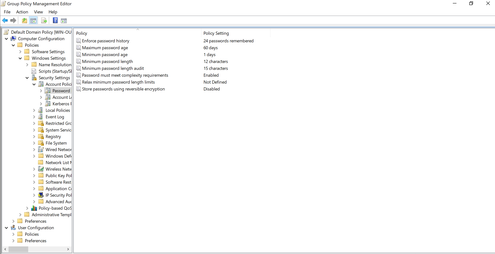
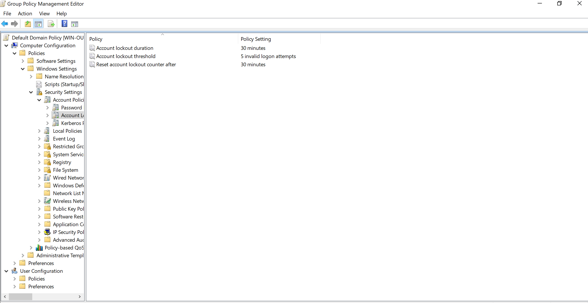
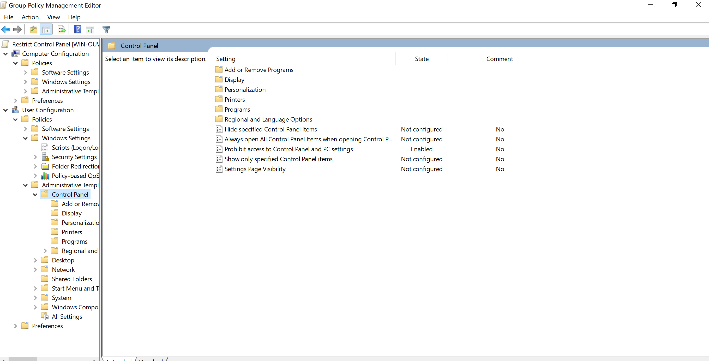
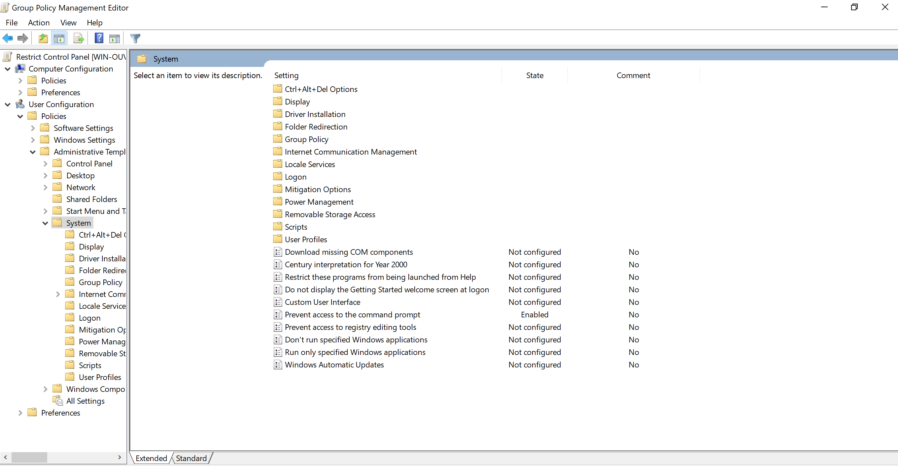

# Group Policy Management

## Description
Implemented centralized workstation management using Active Directory Group Policy Objects (GPOs).

## Objectives
- Enforce security policies
- Standardize workstation configurations

## Tasks Performed

#### Password & Lockout Policy

Configuration:

- Configured maximum password age to 60 days
- Enforced a minimum password length of 12 characters
- Set password length audit threshold to 15 characters
- Enabled password complexity requirements
- Defined account lockout threshold at 5 failed attempts
- Set lockout duration to 30 minutes

Screenshots:

#### Control Panel & CMD Restriction
Configuration:
1. Configured a GPO named “Restrict Control Panel & CMD Policy” and linked it to a specific OU
2. Prevented access to Control Panel and Windows Settings
3. Restricted access to Command Prompt execution

Screenshots:

